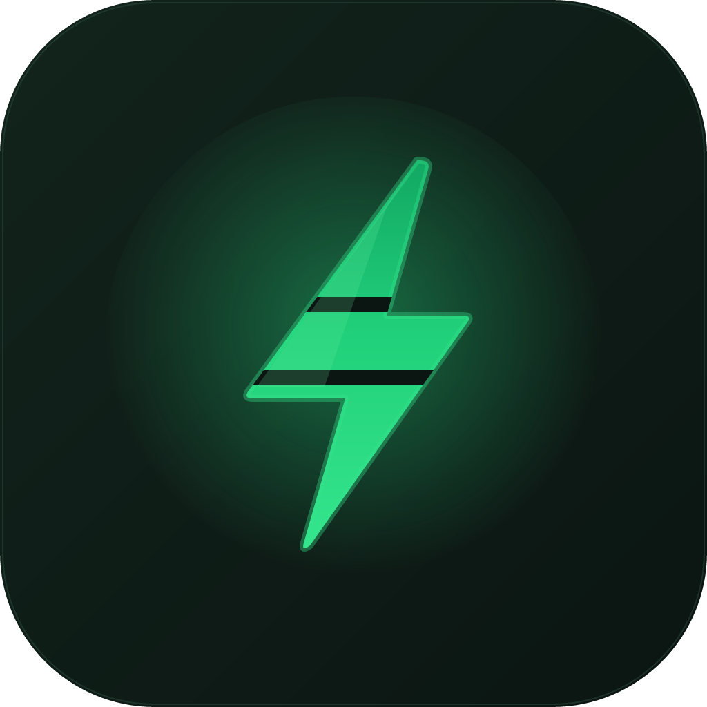

<div align="center">



# MyBattery

**Own your pack.** Local-first monitoring and control for your batteries,
BMSes and power stations — over Bluetooth and serial, straight from your
phone or desktop. No account. No cloud. No telemetry leaving the room.

</div>

---

MyBattery is a cross-platform app (Android · iOS · macOS · Linux · Windows ·
Web) for the [`battery-control`](https://github.com/v0l/battery-control)
library. It discovers your batteries, streams their live state, and lets you
flip switches and edit settings — all talking directly to the hardware.

It's built with Flutter +
[flutter_rust_bridge](https://github.com/fzyzcjy/flutter_rust_bridge): the
Rust crate is the core and does every bit of transport work (BLE, serial,
CAN), so the same battle-tested code runs on every platform.

## What it does

- **Discover** every battery in range across BLE and serial in one scan.
- **Live dashboard** — SOC, voltage, current, power, per-cell voltages and
  balance, temperatures, cycles, alarms — pushed in real time (no polling
  where the device supports it).
- **Control** — toggle charge / discharge / balancer MOSFETs and edit device
  settings (protection thresholds, current limits, …) where the BMS allows.
- **Multiple packs** — each pack shows up as its own battery with its own
  readings.

## Supported hardware

Via `battery-control`'s backends:

| Backend | Devices | Transport |
|---------|---------|-----------|
| **JK** | JIKONG / JK-PB BMS (JK02_24S, JK02_32S) | BLE, serial |
| **Anker** | SOLIX power stations (e.g. C1000) | BLE |
| **Daly** | Daly Smart BMS | serial |
| **Victron** | VE.Direct / Instant Readout monitors | BLE |
| **Pylontech** | CAN packs | CAN (Linux) |

Mobile builds are BLE-only; desktop builds include serial too.

## Privacy

MyBattery talks to your hardware and nothing else. There is no backend, no
account, and no analytics — the name is the promise: it's *your* battery.

## Build & run

Requires the Flutter SDK and a Rust toolchain. The Rust library builds
automatically during `flutter build` (via cargokit) — no separate step.

```sh
flutter pub get
flutter run                 # or: -d macos | -d linux | -d windows | <device>
flutter build apk --release # Android; see below for others
```

Per-platform backend features are selected in `rust/Cargo.toml`
(mobile = `anker`, `jk-ble`; desktop = `full`).

> **BLE note:** a JK BMS accepts only one Bluetooth connection at a time. If a
> pack doesn't appear, make sure no other app (including the official one) is
> connected to it.

## Branding & assets

Source art lives in [`branding/`](branding/) as SVGs, rendered to PNGs with
`node branding/render.js`. Regenerate platform assets after any change:

```sh
dart run flutter_launcher_icons        # app icons, all platforms
dart run flutter_native_splash:create  # splash screens
```

The mark is a lightning bolt sliced into cells — energy and a multi-cell pack
in one shape.

## Project layout

- `rust/` — FRB bridge crate wrapping `battery_control`
- `lib/` — Flutter UI (`screens/discovery_screen.dart`, `screens/dashboard_screen.dart`)
- `lib/src/rust/` — generated bindings (`flutter_rust_bridge_codegen generate`)
- `branding/` — logo/splash SVGs + render script

## Related

- [`battery-control`](https://github.com/v0l/battery-control) — the core Rust library
- [`jktool-rs`](https://github.com/v0l/jktool-rs) — JK BMS protocol crate (`jk_bms`)
- [`battery-ha-bridge`](https://github.com/v0l/battery-ha-bridge) — Home Assistant MQTT bridge

## License

MIT
